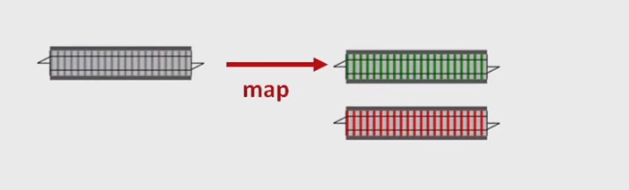
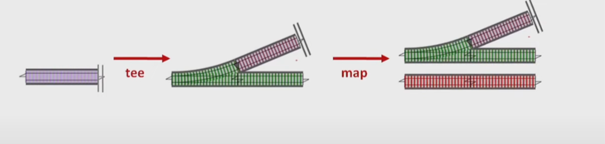
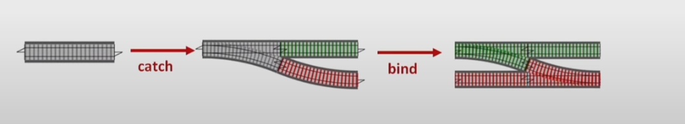
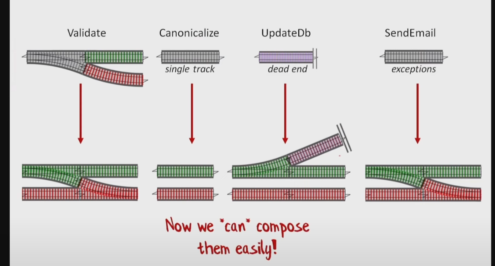
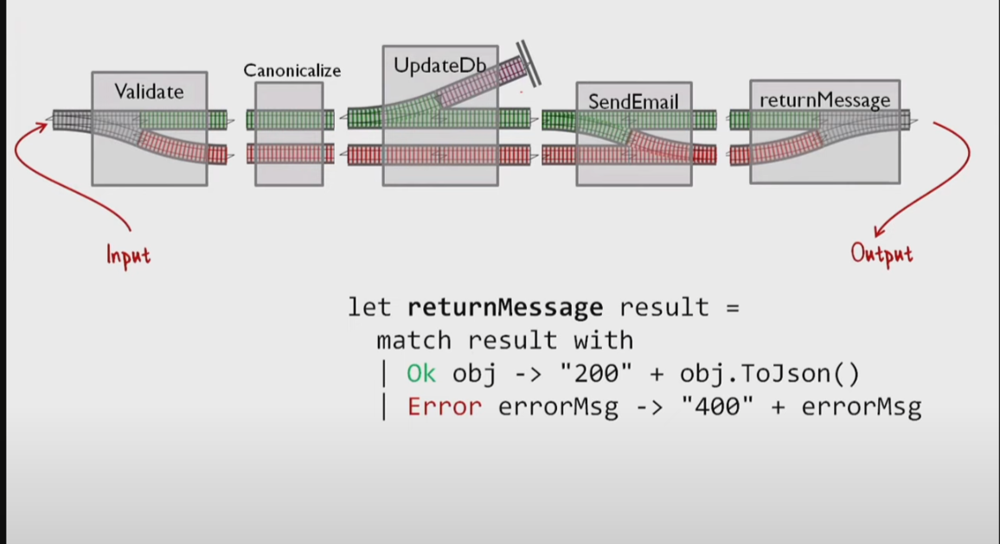

# railway-oriented-programming-utils
### Основные идеи

1. Супер удобочитаемость
2. не надо читать с середины . Пример :
2.1 method1(method2(method3))
2.2 method3 |> method2 |> method1
3. Композиция элементов , method 3 выдает dto1 , method2 принимает dto1 и выдает dto2 , method3 принимает dto2 и выдает dto3
4. Концентрация не только на happy path
5. Если ошибка происходит , то мы делаем ответвление и пускаем весь пайплайн по нему
6. Функция с 1 входом и 2 выходами (Success и Error) называется flatMap (функциональный трансформатор)
7. Изначально мы делаем 2 дорожечные функции
8. Если функция имеет 1 дорожку (даже потенциально не может иметь ошибок из за того что очень простая) то мы пропускаем ошибку через неё. И пропускаем эту функцию через функциональный трансформатор
9. Тупиковые функции (void) , мы заводим в функцию которая вызывает эту функцию и выдает изначальные входные данные
10. Если мы работаем с функциями которые выдают исключения , мы вызываем эту функцию и создаем обработчик ошибок внутри неё и выдаем приятную ошибку (превращаем однодорожечную функцию с исключениями в двух дорожечную функцию без исключений)
11. Не пытайтесь использовать исключения для управления потоком

### bind (flatMap) - трансформатор для превращения однодорожечной функции с исключением в двух дорожечную без исключения.

### map - трансформатор однодорожечной функции без исключений в двух дорожечную без исключений 

### tee - трансформатор для трансформации тупиковой функции , в функцию которая исполняет тупиковую функцию и отдает входные значения . И по итогу мы можем использовать на нем map

### catch - однодорожечную функцию с исключениями мы можем превратить в двух дорожечную функцию без исключений и использовать на ней bind(flatMap)

## Пример использования

## Пример в коде на языке F#

